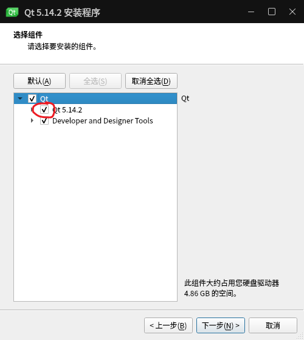
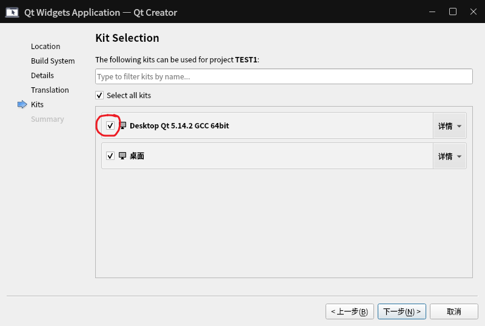

# Unary Sparse Polynomial Calculator

一元稀疏多项式计算器，Qt实现，C++版

---

运行环境：Windows、Ubuntu、Ubuntu kylin

QtCreator

接下来以[Ubuntu kylin](https://www.ubuntukylin.com/downloads/)举例

## Ubuntu kylin

### 安装g++

Ubuntu kylin默认已安装gcc

```bash
sudo apt update
//直接安装报错：E:无法获得锁 /var/cache/apt/archives/lock
sudo rm -f /var/cache/apt/archives/lock
sudo rm -f /var/lib/dpkg/lock
sudo apt-get install g++
```

### 安装libGL

```bash
sudo apt-get install libgl1-mesa-dev
```

### 安装QtCreator

[链接](https://download.qt.io/archive/qt/5.12/5.12.8/)下载qt-opensource-linux-x64-5.12.8.run

```bash
chmod +x qt-opensource-linux-x64-5.12.8.run
./qt-opensource-linux-x64-5.12.8.run
```

安装时注意勾选此选项↓



创建项目时勾选↓



> 安装路径：file://opt/Qt5.12.8/Tools/QtCreator/bin

### 直接编译

```bash
cd {directory}
qmake
./NUC  按下tab自动补全后即可运行
```

# 基本要求&功能

1. 输出多项式，输出形式为整数序列：n,c~1~,e~1~,c~2~,e~2~,…,c~n~,e~n~，其中n是多项式的项数，c~i~,e~i~分别是第i项的系数和指数，序列按指数降序排列。
2. 实现多项式a和b相加、相减，建立多项式a+b、a-b。

3. 计算多项式在x处的值。

# 后续改进

- 当指数存在负数时会出bug，可参照[逆波兰表达式——中缀表达式转后缀表达式](https://www.cnblogs.com/lanhaicode/p/10776166.html)进行修改
